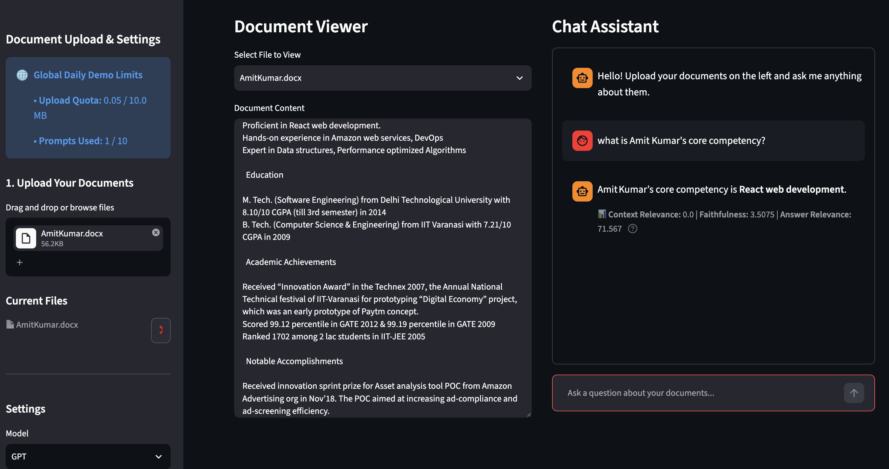
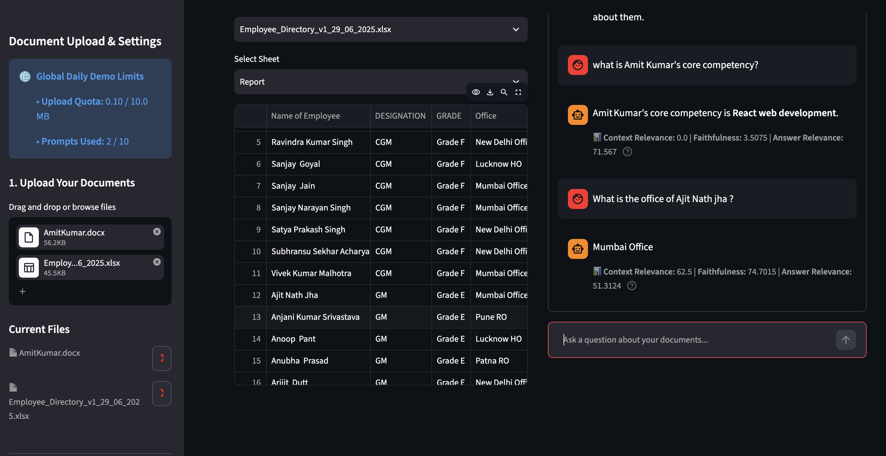
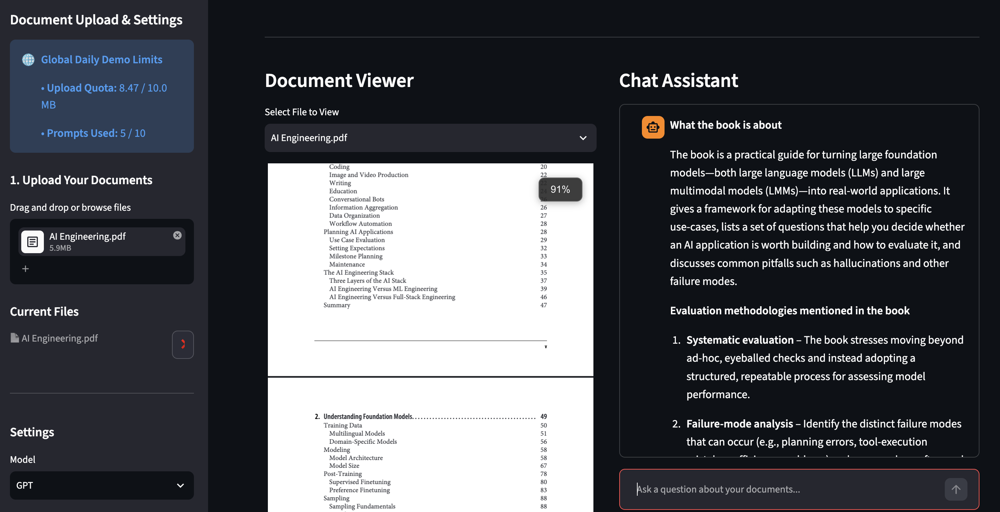

# Hybrid RAG Project

A high-performance, modular multi-document Retrieval-Augmented Generation (RAG) system built with **Streamlit**, **SentenceTransformers**, and **Cross-Encoders**. This repository combines dense vector search with sparse BM25 keyword search, reranks results using a Cross-Encoder model, and evaluates response quality using the RAG Triad framework.



---

## Features

* **Hybrid Retrieval System:** Combines sparse BM25 keyword matching with dense vector embeddings (`all-MiniLM-L6-v2`) for higher retrieval recall.
* **Cross-Encoder Reranking:** Uses `BAAI/bge-reranker-base` to rerank initial retrieved document chunks for maximum context precision.
* **RAG Triad Evaluation:** Integrated automated evaluation pipeline scoring context relevance, faithfulness (via `cross-encoder/nli-deberta-v3-base`), and answer relevance.
* **Interactive Streamlit UI:** Side-by-side split layout featuring live document viewing alongside an interactive chat interface.
* **Multi-Format Parsing & Rate Limiting:** Multi-file parsing utilities (PDF, DOCX, XLSX, PPTX) paired with usage limit tracking.
* **Docker Support:** Containerized setup for easy local deployment.

---

## Repository Structure

```text
hybrid-rag-project/
├── .streamlit/           # Streamlit app configuration
├── .vscode/              # Editor settings
├── rag/                  # Core RAG engine components
│   ├── __init__.py
│   ├── embedder.py       # Dense vector embedder (SentenceTransformer)
│   ├── evaluator.py      # RAG Triad evaluation metrics (DeBERTa NLI)
│   ├── pipeline.py       # Main end-to-end RAG workflow orchestration
│   ├── reranker.py       # Cross-Encoder reranking model
│   └── retriever.py      # BM25 sparse keyword retriever
├── tests/                # Unit and integration tests
│   ├── .gitkeep
│   └── test_documents.py
├── utils/                # Helper utilities
│   ├── __init__.py
│   ├── document_parsers.py# Extract text from PDF, DOCX, XLSX, PPTX
│   └── limit_tracker.py  # Rate limiting and usage tracking
├── .dockerignore
├── .env / .env.example   # Environment variables configuration
├── .gitignore
├── app.py                # Main Streamlit application entry point
├── Dockerfile            # Container configuration
├── README.md             # Project documentation
└── requirements.txt      # Python dependencies
```

## Architecture Overview

### 1. Document Parsing & Chunking
**File:** `utils/document_parsers.py`

Converts uploaded user files into clean, structured text chunks suitable for retrieval and downstream processing.

### 2. Dense & Sparse Indexing
**Files:** `rag/embedder.py`, `rag/retriever.py`

- Encodes document chunks into dense vector embeddings using **all-MiniLM-L6-v2**.
- Builds a sparse retrieval index using a custom **BM25Retriever** for efficient keyword-based search.
- Combines semantic and lexical retrieval for improved recall.

### 3. Cross-Encoder Reranking
**File:** `rag/reranker.py`

Uses **BAAI/bge-reranker-base** to rerank retrieved passages and prioritize the most relevant context before passing it to the LLM.

### 4. RAG Triad Evaluation
**File:** `rag/evaluator.py`

Evaluates retrieval and generation quality using:

- **Context Relevance** – Measures how relevant retrieved passages are to the user query.
- **Answer Faithfulness** – Uses **nli-deberta-v3-base** for NLI-based entailment checking to verify that generated answers are supported by retrieved context.
- **Answer Relevance** – Measures how well the generated answer addresses the original question.

---

# Quickstart Guide

## Option 1: Run Locally

### Clone the Repository

```bash
git clone https://github.com/your-username/hybrid-rag-project.git
cd hybrid-rag-project
```

### Create a Virtual Environment

```bash
python -m venv venv
```

Activate the environment:

**Linux / macOS**

```bash
source venv/bin/activate
```

**Windows**

```bash
venv\Scripts\activate
```

### Install Dependencies

```bash
pip install -r requirements.txt
```

### Configure Environment Variables

```bash
cp .env.example .env
```

Update the `.env` file with the required API keys and configuration values.

### Launch the Application

```bash
streamlit run app.py
```

---

## Option 2: Run with Docker

### Build the Docker Image

```bash
docker build -t hybrid-rag-app .
```

### Run the Container

```bash
docker run -p 8501:8501 --env-file .env hybrid-rag-app
```

The application will be available at:

```text
http://localhost:8501
```

---

# Running Tests

Execute unit tests for document parsing and pipeline components:

```bash
pytest tests/
```

# Additional Screenshots

----------------------------------------------------
